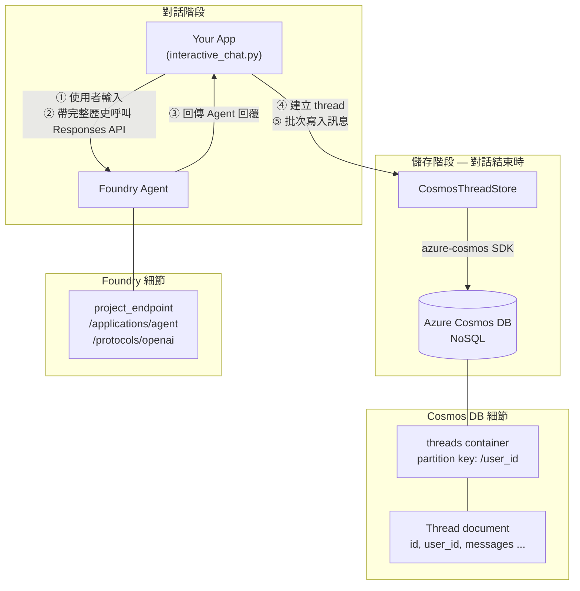

# BYO Thread Storage — Azure Cosmos DB for Foundry Agent

用 Azure Cosmos DB 儲存 Microsoft Foundry Agent 的對話紀錄，讓你完全掌控對話歷史的查詢、稽核與刪除。

---

## 一、專案簡介

Microsoft Foundry Agent 預設在內部管理對話歷史。本專案實作 **Bring Your Own (BYO) Thread Storage**，透過 **OpenAI Responses API endpoint** 與 Agent 互動，並將對話執行緒（thread）與訊息（message）持久化到你自己的 Azure Cosmos DB，好處包括：

- 自由查詢、匯出對話紀錄
- 按需刪除執行緒（合規需求）
- 將對話歷史整合進你的應用邏輯

---

## 二、專案結構

```
├── src/
│   ├── models.py              # 資料模型：Thread、Message dataclass
│   ├── thread_store.py        # 核心：CosmosThreadStore（所有 Cosmos DB CRUD）
│   ├── agent_integration.py   # Foundry Agent 整合（對話流程串接）
│   ├── config.py              # 環境變數設定
│   └── exceptions.py          # 自定義例外
├── examples/
│   ├── basic_usage.py         # CRUD 操作範例
│   ├── agent_chat.py          # 多輪 Agent 對話範例（腳本式）
│   └── interactive_chat.py    # 互動式 Agent 對話（推薦）
├── tests/                     # 單元測試 & 整合測試
├── pyproject.toml
└── requirements.txt
```

---

## 三、快速開始

### 1. 前置需求

| 需求 | 說明 |
|------|------|
| Microsoft Foundry agent | Agent 對話需要 |
| Azure Cosmos DB for NoSQL | Serverless 或 ≥ 400 RU/s |
| Cosmos DB RBAC | 你的 Azure 身份需要帳戶上的 **Cosmos DB Built-in Data Contributor** 角色（見下方 §1.5） |
| Cosmos DB 網路存取 | 帳戶的 **Networking** 需啟用 **Public network access**，或將開發機 IP 加入防火牆白名單 |
| [Azure CLI](https://learn.microsoft.com/en-us/cli/azure/install-azure-cli?view=azure-cli-latest) | `az login` 完成，或設定 Managed Identity |
| Clone Repo | `git clone https://github.com/ownway22/BYO-thread-storage-azure-cosmos-for-foundry-agent.git` |
| Python | ≥ 3.11 |
| [uv](https://docs.astral.sh/uv/) | Python 套件管理器 |

> ⚠️ **特別注意**：即使你的 Azure 身份是 Subscription **Owner / Contributor**，預設**仍無法**讀寫 Cosmos DB 內的資料。原因是 Cosmos DB 有「兩套」獨立的 RBAC 系統（見下方 §1.5）。沒有先指派 Data Plane 角色就執行範例，會看到類似下面的錯誤：
>
> ```
> azure.cosmos.exceptions.CosmosHttpResponseError: (Forbidden)
> Request is blocked because principal [<your-principal-id>] does not have
> required RBAC permissions to perform action
> [Microsoft.DocumentDB/databaseAccounts/readMetadata] on resource [/].
> ```

### 1.5 指派 Cosmos DB Data Plane 角色（必要步驟）

**為什麼需要這一步？** Azure Cosmos DB 有「兩套」獨立的 RBAC 系統，它們互不相通：

| RBAC 類型 | 控制範圍 | 範例角色 | 在哪指派 |
|----------|---------|---------|---------|
| **Azure Control Plane RBAC**（管理層） | 管理 Cosmos DB 帳戶本身（建立、刪除、設定 firewall、看 keys） | Owner、Contributor、Cosmos DB Account Reader | Portal → IAM 或 `az role assignment create` |
| **Cosmos DB Data Plane RBAC**（資料層） | 讀寫 database / container / item 內的資料 | **Cosmos DB Built-in Data Contributor**、Built-in Data Reader | **僅** CLI / ARM / Bicep（Portal IAM 看不到） |

即使是 Subscription **Owner**，也只是「管理層」權限，**不會自動授予資料層權限**。所以你必須在 Cosmos DB 帳戶上**額外**指派 Data Plane 角色，本專案的 SDK 操作才能成功。

#### 透過 Azure CLI 指派（推薦）

請具備 Cosmos DB 帳戶 Owner 權限的人執行以下指令：

```bash
# 1. 設定變數
RESOURCE_GROUP="<your-resource-group>"
ACCOUNT_NAME="<your-cosmos-account-name>"

# 取得目前登入身份的 principal ID（也可以換成其他使用者 / Service Principal / Managed Identity 的 object ID）
PRINCIPAL_ID=$(az ad signed-in-user show --query id -o tsv)

# 2. 取得 Cosmos 帳戶的 resource ID 作為 scope
SCOPE=$(az cosmosdb show \
  --name $ACCOUNT_NAME \
  --resource-group $RESOURCE_GROUP \
  --query id -o tsv)

# 3. 指派「Cosmos DB Built-in Data Contributor」
#    角色定義 ID 00000000-0000-0000-0000-000000000002 = Built-in Data Contributor（讀+寫）
#    若僅需讀取，改用 ...0001（Built-in Data Reader）
az cosmosdb sql role assignment create \
  --account-name $ACCOUNT_NAME \
  --resource-group $RESOURCE_GROUP \
  --scope "$SCOPE" \
  --principal-id $PRINCIPAL_ID \
  --role-definition-id 00000000-0000-0000-0000-000000000002
```

#### 驗證指派成功

```bash
az cosmosdb sql role assignment list \
  --account-name $ACCOUNT_NAME \
  --resource-group $RESOURCE_GROUP \
  -o table
```

看到自己的 `PRINCIPAL_ID` 對應到 `00000000-0000-0000-0000-000000000002` 即代表成功。

#### 注意事項

- **指派後需要幾分鐘才會生效**，不是立刻可用。
- `--scope` 設為整個帳戶後，未來建立的所有 database / container 都涵蓋；也可以縮小到單一 database 或 container。
- `az login` 後使用的身分必須跟 `PRINCIPAL_ID` 對應，否則 SDK 拿到的 token 會是別人的。
- Portal → Cosmos 帳戶 → **Access control (IAM)** 頁面**看不到** Built-in Data Contributor，那裡只能看到管理層 RBAC（這正是讓很多人踩坑的地方）。

### 2. 安裝相依套件

```bash
uv sync
```

### 3. 設定環境變數

複製 `.env.sample` 為 `.env`，填入你的值：

```bash
cp .env.sample .env
```

| 變數 | 預設值 | 說明 |
|------|--------|------|
| `COSMOS_ENDPOINT` | — | Cosmos DB endpoint URL |
| `COSMOS_DATABASE_NAME` | `thread_storage` | 資料庫名稱 |
| `COSMOS_CONTAINER_NAME` | `threads` | Container 名稱 |
| `AZURE_AI_PROJECT_ENDPOINT` | — | Foundry project endpoint |
| `FOUNDRY_AGENT_NAME` | — | Foundry Agent 應用名稱（如 `RAI-agent`） |
| `FOUNDRY_MODEL_NAME` | — | Agent 底層模型（如 `gpt-4.1-mini`） |

### 4. 執行範例

**互動式 Agent 對話**：

```bash
uv run examples/interactive_chat.py
```

啟動後會進入互動式對話模式，你可以即時與 Foundry Agent 進行多輪對話。以下是執行成功的範例畫面：


結束對話後，所有訊息會一次儲存到 Cosmos DB，並在 terminal 顯示 **Thread ID**（如上圖中的 `adbf6bb7-fbd7-4b26-b9d3-112fb7a8217b`）。

### 5. 驗證對話紀錄

執行完成後，你可以到 **Azure Portal** 的 Cosmos DB 帳戶，開啟 **Data Explorer**，在 `threads` container 中以 Thread ID 查詢，即可看到完整的對話紀錄已成功寫入（如上圖中的 `adbf6bb7-fbd7-4b26-b9d3-112fb7a8217b`）：


這證明對話歷史已透過 `CosmosThreadStore` 正確持久化到你自己的 Azure Cosmos DB。

## 四、架構概覽



---

## 五、Agent × Cosmos DB 整合關鍵

### 1. 資料模型（`src/models.py`）

採用 **嵌入式設計**——訊息直接嵌入在 Thread 文件中，以 `user_id` 做為 partition key：

```python
@dataclass
class Thread:
    user_id: str                    # partition key（高基數）
    id: str                         # thread UUID
    messages: list[Message]         # 嵌入的訊息陣列
    created_at: str
    updated_at: str
    metadata: dict[str, Any]

@dataclass
class Message:
    role: str       # "user" | "assistant" | "system"
    content: str
    timestamp: str
```

`Thread.to_dict()` / `Thread.from_dict()` 負責與 Cosmos DB 文件格式互轉。

### 2. Cosmos DB CRUD（`src/thread_store.py`）

`CosmosThreadStore` 封裝所有資料庫操作：

| 方法 | 作用 |
|------|------|
| `initialize()` | 建立 database / container（若不存在） |
| `create_thread()` | 建立新對話執行緒 → `container.create_item()` |
| `append_message()` | **寫入訊息的核心方法**——讀取 thread → 追加 message → `replace_item()` + ETag 樂觀並行控制（最多重試 3 次） |
| `get_messages()` | 取得某 thread 的完整訊息列表 |
| `get_thread()` | 以 point read 取得單一 thread |
| `list_threads()` | 參數化查詢列出使用者所有 thread（不含 messages，節省 RU） |
| `delete_thread()` | 刪除指定 thread |

**`append_message()` 是最關鍵的方法**，使用 ETag 樂觀並行確保多 client 同時寫入時資料不會遺失。

### 3. 對話流程串接（`src/agent_integration.py`）

`run_agent_conversation()` 把 Cosmos DB 和 Foundry Agent 串在一起：

```
1. thread_id 為空 → store.create_thread()        # 建立新執行緒
2. store.append_message("user", user_message)      # 存入使用者訊息
3. store.get_messages()                             # 取出完整歷史
4. Responses API → Foundry Agent endpoint          # 帶歷史上下文送給 Agent
5. store.append_message("assistant", agent_reply)   # 存入 Agent 回覆
```

Agent 端點格式為 `{project_endpoint}/applications/{agent_name}/protocols/openai`，使用 `openai.OpenAI` 客戶端的 `responses.create()` 方法呼叫。這確保**每一輪對話的使用者訊息和 Agent 回覆都被持久化**，下次對話時可取回完整歷史做為上下文。

---

## 六、參考資料

- [BYO Thread Storage in Azure AI Foundry Using Python — Tech Community](https://techcommunity.microsoft.com/discussions/azure-ai-foundry-discussions/byo-thread-storage-in-azure-ai-foundry-using-python/4468147)
- [Azure AI Foundry Connection for Azure Cosmos DB and BYO Thread Storage — DevBlogs](https://devblogs.microsoft.com/cosmosdb/azure-ai-foundry-connection-for-azure-cosmos-db-and-byo-thread-storage-in-azure-ai-agent-service/)
- [Azure Cosmos DB for Azure Agent Service — Microsoft Learn](https://learn.microsoft.com/en-us/azure/cosmos-db/gen-ai/azure-agent-service)
- [Cosmos DB Built-in Data Contributor 角色定義](https://learn.microsoft.com/en-us/azure/cosmos-db/reference-data-plane-security#cosmos-db-built-in-data-contributor)